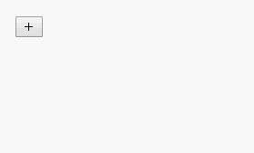

# Task
Oftentimes, when creating forms for web applications, we'd like to offer a dynamic number of input fields for the user. Controls such as adding, removing and reordering these fields can help make the experience of filling out a form or organizing a set of text items intuitive for the user.

For this challenge, we've provided a mostly-working DynamicInput component which is failing a couple of our tests (/__tests__/DynamicInput.test.jsx). Your job is to read the source code in /src/components/DynamicInput.jsx and fix the bug(s) so the tests pass.

Below, you'll find a detailed behavioral specification which is enforced by the test cases. However, you will likely not need to read all of it as the core functionality is implemented. We recommend looking at the code and demo gif at the bottom of these instructions and playing with the Web Preview first. You can then resort to the functional specification on an as-needed basis and to avoid regressions.

## DynamicInput behavioral specification
### Rendered elements
- ```<button class="add-row">```, an always-available button to append a text field and its corresponding buttons (we'll call this a row henceforth) onto the list of visible fields.
- A list of zero or more rows of input elements and action buttons:
  - ```<input class="row-input" />```, which offers the user a place to enter text for the n-th row.
  - ```<button class="row-up">```, which enables the n-th row to be moved up (if it's not already at the top of the list).
  - ```<button class="row-down">```, which enables the n-th row to be moved down (if it's not already at the bottom of the list).
  - ```<button class="row-delete">```, which enables the n-th row to be removed from the list.
The test suite relies on these class names to manipulate the component.

### Adding an input field row
Initially, the component will only offer a single button, ```<button class="add-row">```, which, when clicked, will append a new input field to the list of input fields. After clicking this box, focus should be on the newly created input field so the user can begin typing right away. Along with each input field, three corresponding buttons should be created, as described above:
  - ```<button class="row-up">```
  - ```<button class="row-down">```
  - ```<button class="row-delete">```

### Text input
The user may enter text into any of the visible ```<input class="row-input" />``` elements at any time.

### Removing an input field row
Clicking the ```<button class="row-delete">``` button associated with an input field should completely remove that input field, along with any other associated buttons for that field. Focus will move to the input field in the row which replaced the deleted row, nowhere if there are no fields left, or on the new last row if the last row was deleted.

### Moving a field row up
Clicking the ```<button class="row-up">``` button associated with an input field should move that input field one position up in the list (or forward; closer to the beginning of the list). Focus should be placed on the newly moved field after this operation, and all associated buttons should move alongside the element. If a field is already at the top of a list, no reordering should occur, but focus should be transferred to the topmost field nonetheless.

### Moving a field row down
Clicking the ```<button class="row-down">``` button associated with an input field should move that input field one position down in the list (or backward; closer to the end of the list). Focus should be placed on the newly moved field after this operation, and all associated buttons should move alongside the element. If a field is already at the bottom of a list, no reordering should occur, but focus should be transferred to the bottommost field nonetheless.

### Demo
This demo shows the finished app in action. Note the behavior of focus after each button operation.

</img>

### Rubric
For this challenge, you're assessed on passing test cases and ensuring your adjustments adhere to React safety principles.

It's not necessary to rewrite the component to use additional, different or better abstractions--we're mostly looking to see that you understand how to work with state and hooks and can identify and fix a problem quickly.

### Resources
Feel free to consult documentation as you need. Good places to begin include React's documentation and Enzyme's documentation.

