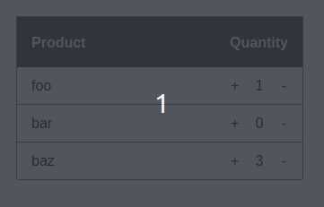

# Task
This challenge builds upon a basic Click Counter component, the code for which has been provided in the workspace. The Counter component offers a readout of its current value and increment/decrement buttons to adjust that value. You can run and interact with this component using Web Preview.

In this challenge, your task is to create a component called Inventory. This component will use the basic Counter component along with an array of product props to support a very simple inventory management system. The click counter will let a user increase and decrease quantities of items by clicking buttons associated with a product. Since there's no back-end, this inventory is a mock-up.

## Props
The prop for the Inventory component is an array of objects in the format

```
[
  {id: 1, name: "foo", quantity: 1},
  {id: 2, name: "bar", quantity: 0},
  {id: 3, name: "baz", quantity: 3},
]
```

id is guaranteed unique, name will always be a nonempty alphabetical string and quantity will always be an integer 0 or greater.

## Functional requirements
This section outlines the requirements for this challenge. You'll be evaluated on a test suite provided in __tests__/Inventory.test.jsx in the project directory. These Jest/Enzyme tests will verify that your component renders certain elements which exhibit the behavior described below.

Your Inventory can be a class or functional component and should render a list of elements with the attribute ```data-test="items"```. The HTML structure for items is flexible but must include the following testable elements per item:

An element with an attribute of ```data-test="item-name"``` showing the item name.
An element with an attribute of ```data-test="item-qty"``` showing the current quantity for an item.
A counter increment button with a class of ```data-test="increment-qty"``` which should increase the quantity for an item by 1 on click.
A counter decrement button with a class of ```data-test="decrement-qty"``` which should decrease the quantity for an item by 1 on click but never below 0.
You may modify the provided Counter component as you see fit to achieve your goals. You can also modify the test suite but your changes will be reverted to the original upon submission.

CSS, classes, much of the HTML structure and button text throughout the challenge will not be tested and are up to you.

# Rubric
You'll be evaluated foremost on passing the provided test cases and secondarily on writing clean and idomatic React and JS code. Identical tests with different data will be run upon submission to ensure your solution is dynamic.

CSS will not be evaluated by the test suites. Spend 10-15 minutes adding simple styling of your choice to communicate a sense of your comfort with it.

## Screen capture
Here's a screen capture of the working Inventory component (your styling need not appear like this):

</img>

## Resources
Feel free to consult React's documentation if you get stuck.