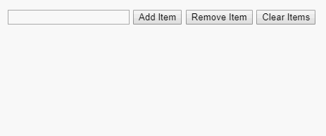

# Task
Web applications often require keeping a unique list of items entered by a user. For example, an app containing a list of category tags for a post should prevent the user from entering duplicate tags.

For this challenge, you'll create a simple component UniqueList which renders the following skeleton:
```
<>
  <div>
    <input
      className="item-input"
      type="text"
      value={text}
      onChange={onChangeHandler}
      onKeyDown={onKeyDownHandler}
    />
    <input
      className="add-button"
      type="button"
      value="Add Item"
      onClick={addHandler}
    />
    <input
      className="remove-button"
      type="button"
      value="Remove Item"
      onClick={removeHandler}
    />
    <input
      className="clear-button"
      type="button"
      value="Clear Items"
      onClick={clearHandler}
    />
  </div>
  <ul className="items">
  </ul>
</>
```

Note that you may change the above function and variable names for your handlers, but make sure the DOM remains functionally intact for the test suite to use.

## Functionality Specifications
Here are the requirements you'll be implementing for the UniqueList component.

## Text input
The user will enter text into the ```<input class="item-input" />``` field. This input element should be a controlled component and have a listener for Enter key presses, which will activate the add item functionality as if the ```<input class="add-button" />``` button had been clicked. The input element should also respond to onChange for updating state. Upon submission of the input field's content, the value should have leading and trailing whitespace trimmed before any subsequent operation is performed.

## Adding items
After whitespace trimming, an item from the submitted input using the add button (or, equivalently, pressing Enter when focused on the ```<input class="item-input" />``` element) will be added to the list and appended to the ```<ul class="items">``` as an ```<li>``` child if it is not an empty string and it is not already present in the list (case sensitive).

## Removing items
After whitespace trimming, an item from the submitted input using the remove item button (```<input class="remove-button" />```) will be removed from the list if it is not an empty string and it is not already present in the list (case sensitive).

## Clearing items
The clear items button (```<input class="clear-button" />```) should clear the list completely, updating the state only if the list wasn't already empty.

## Updating state and DOM
Only update the component's state if the add, remove or clear operation resulted in a change to the list contents. More specifically, if any of the add, remove or clear operations failed in response to an event (the text input element was empty or entirely whitespace, the item was already in the list upon add, the item wasn't in the list upon removal, or a clear operation was performed on an empty list), don't update the DOM or clear the input text field.

Conversely, if any action was successful in updating DOM state, clear the input element's text content.

## Style
Include some simple CSS and design in your component's stylesheet. There is no predefined correct way of handling these; the goal is to get a sense for your comfort level with both.

## Demo
This demo shows the finished app in action. Note cases when the input element is cleared and when it isn't, and the trimming behavior for all strings input via the text field.

